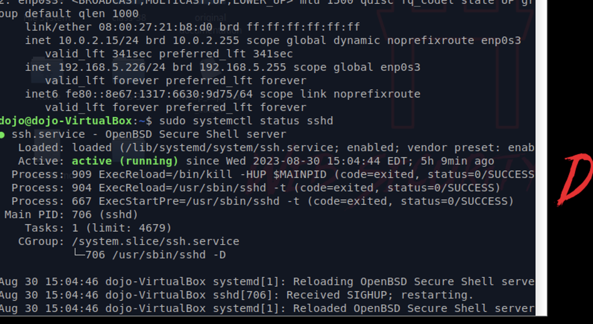
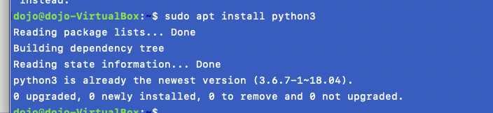
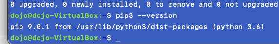
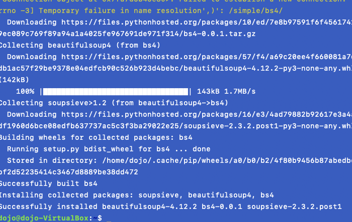
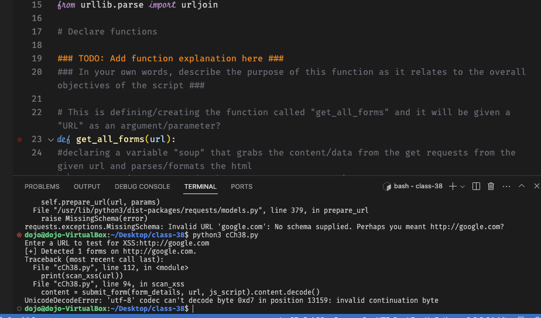
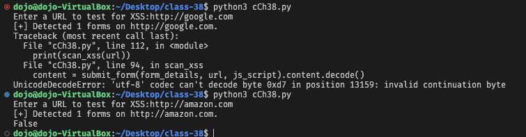

# !/usr/bin/env python3

# Script Name:                  XSS Vulnerability Detection with Python

# Author:                       Raphael Chookagian

# Date of latest revision:      08/30/2023

# Purpose:                      Create a python script

# Author:      Abdou Rockikz

# Description: TODO: XSS Vulnerability Detection with Python

# Date:        TODO: 08/30/2023

# Modified by: TODO: Raphael Chookagian

### TODO: Install requests bs4 before executing this in Python3

# pip3 install bs4

# Import libraries

import requests
from pprint import pprint
from bs4 import BeautifulSoup as bs
from urllib.parse import urljoin

# Declare functions

### TODO: Add function explanation here ###

### In your own words, describe the purpose of this function as it relates to the overall objectives of the script ###

# This is defining/creating the function called "get_all_forms" and it will be given a "URL" as an argument/parameter?

def get_all_forms(url):
  #declaring a variable "soup" that grabs the content/data from the get requests from the given url and parses/formats the html
    soup = bs(requests.get(url).content, "html.parser")
    # returns all of the "form" matches
    return soup.find_all("form")

### TODO: Add function explanation here ###

### In your own words, describe the purpose of this function as it relates to the overall objectives of the script ###

# defines/creates a function names get_form_details that will take in "form"

def get_form_details(form):

# declaring variables that will be used to control and access the data

    details = {}
    # variable for the "action" of the form
    action = form.attrs.get("action").lower()
    # variable for the "method" of the form
    method = form.attrs.get("method", "get").lower()
    inputs = []
    # for loop that iterates through each input type
    for input_tag in form.find_all("input"):
        input_type = input_tag.attrs.get("type", "text")
        input_name = input_tag.attrs.get("name")
        inputs.append({"type": input_type, "name": input_name})
    details["action"] = action
    details["method"] = method
    details["inputs"] = inputs
    return details

### TODO: Add function explanation here ###

### In your own words, describe the purpose of this function as it relates to the overall objectives of the script ###

# declare/create function to submit the form that takes in the form_details, url and value

def submit_form(form_details, url, value):

# declaring variables needed for this function

# variable is joining the url and form details/inputs

    target_url = urljoin(url, form_details["action"])
    inputs = form_details["inputs"]
    data = {}
    # for loop that searches through/iterates through to find the given input.
    for input in inputs:
        if input["type"] == "text" or input["type"] == "search":
            input["value"] = value
        input_name = input.get("name")
        input_value = input.get("value")
        if input_name and input_value:
            data[input_name] = input_value

# if/else if data matches search we return the data

    if form_details["method"] == "post":
        return requests.post(target_url, data=data)
    else:
        return requests.get(target_url, params=data)

### TODO: Add function explanation here ###

### In your own words, describe the purpose of this function as it relates to the overall objectives of the script ###

# declaring function to scan/detect cross-site scripting that takes in a url

def scan_xss(url):

# declaring out variable(s)

    forms = get_all_forms(url)
    # printing results of matches to forms on given url
    print(f"[+] Detected {len(forms)} forms on {url}.")
    ### TODO: Add HTTP and JS code here that will cause a XSS-vulnerable field to create an alert prompt with some text.

    js_script = ""

    is_vulnerable = False
    # for loop to iterate through forms/search data
    for form in forms:
      # declaring needed variables
        form_details = get_form_details(form)
        content = submit_form(form_details, url, js_script).content.decode()
        # checking and notifying in case of detection of XSS
        if js_script in content:
            print(f"[+] XSS Detected on {url}")
            print(f"[*] Form details:")
            pprint(form_details)
            # updates "is_vulnerable" variable to True
            is_vulnerable = True
    return is_vulnerable

# Main

### TODO: Add main explanation here ###

### In your own words, describe the purpose of this main as it relates to the overall objectives of the script ###

# if "main" equals main/ if main is true/exists, then we run the following

if __name__ == "__main__":

# delcare "url" variable by asking user for input and print the results of running scan_xss(url) function

    url = input("Enter a URL to test for XSS:")
    print(scan_xss(url))

### TODO: When you have finished annotating this script with your own comments, copy it to Web Security Dojo

### TODO: Test this script against one XSS-positive target and one XSS-negative target

### TODO: Paste the outputs here as comments in this script, clearling indicating which is positive detection and negative detection

